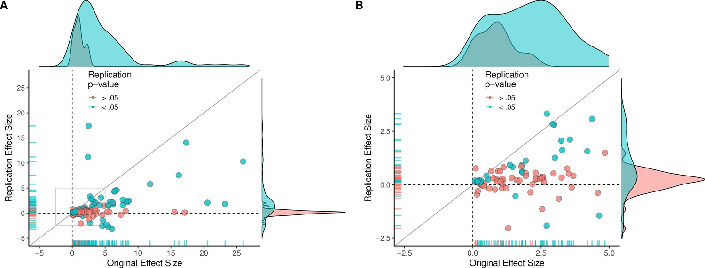
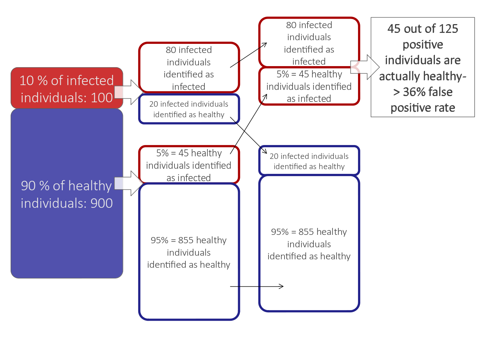
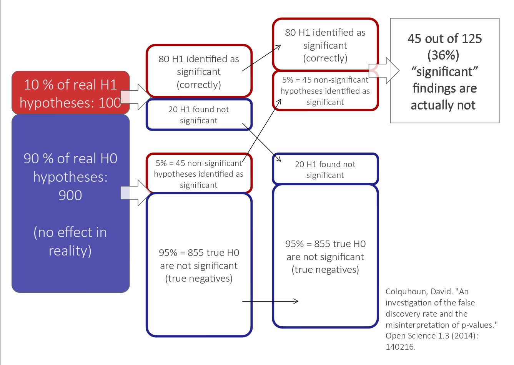
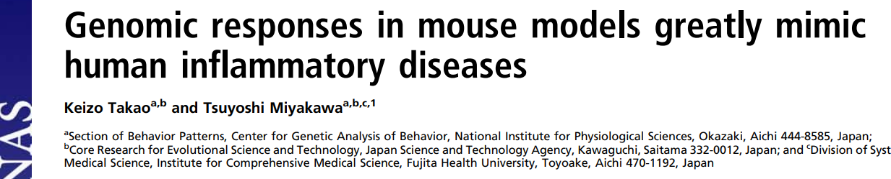
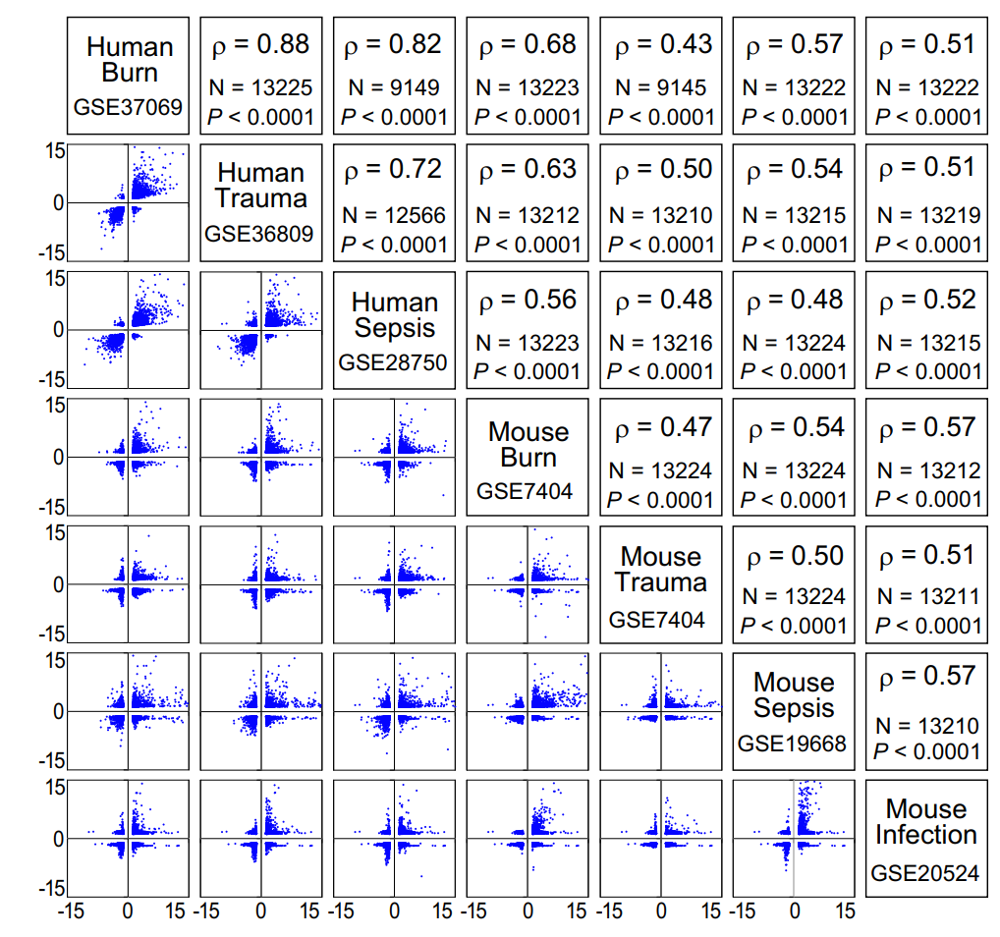
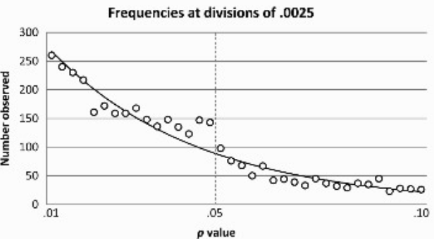

```{r,echo=FALSE}
## Set default options for the knitr RMD processing
knitr::opts_chunk$set(echo=FALSE,warning=FALSE,message=FALSE,fig.width=5,fig.height=5,cache=FALSE,autodep=TRUE, results="hide")
library(pander)
library(knitr)
library(kableExtra)
library(tidyverse)
library(tmod)
library(tidyverse)
library(limma)
library(GEOquery)
library(DESeq2)
## install bioshmods from github.com/bihealth/bioshmods
library(bioshmods)
library(tmod)
library(cowplot)
library(stringr)
library(ggvenn)
library(ggplot2)
library(ggpval)
library(eulerr)
library(Biobase)
library(org.Hs.eg.db)
theme_set(theme_minimal() + theme(panel.grid.major = element_blank(), panel.grid.minor = element_blank()))
source("functions.R")
```

```{r echo=FALSE,include=FALSE,eval=TRUE}
options(crayon.enabled = TRUE)
options(crayon.colors = 256)
knitr::knit_hooks$set(output = function(x, options){
  paste0(
    '<pre class="r-output"><code>',
    fansi::sgr_to_html(x = htmltools::htmlEscape(x), warn = FALSE),
    '</code></pre>'
  )
})

## this is an ugly, ugly hack, but otherwise crayon does not LISTEN TO REASON!!!
num_colors <- function(forget=TRUE) 256
library(crayon)
assignInNamespace("num_colors", num_colors, pos="package:crayon")
```


```{r libraries,cache=FALSE}
library(tidyverse)
```

## Berlin Institute of Health

.pull-left[

 * Institute for translational and precision medicine

 * Founded in 2013 by Max Delbrück Center for
   Molecular Medicine and Charité – a university hospital affiliated with
   both Humboldt University and Free University Berlin.

 * Since 2020 a part of the Charité

]


???

Charité – over 15,000 employes


---

## Reproducibility crisis in science



.myfootnote[
*Investigating the replicability of preclinical cancer biology
TM Errington, M Mathur, CK Soderberg, …* - eLife, 2021
]

---

## Reproducibility crisis in science


.myfootnote[
*Perrin, Steve. "Preclinical research: Make mouse studies work." Nature
News 507.7493 (2014): 423.*
]

---

## Reproducibility crisis in science


.myfootnote[
*Ioannidis JP. Why most published research findings are false. PLoS medicine. 2005 Aug 30;2(8):e124.*
]

---

## Reasons for the reproducibility crisis:<br>Misunderstanding and misusing of statistics

.center[


]

---

## Reasons for the reproducibility crisis:<br>Misunderstanding and misusing of statistics

--

 * file drawer (suppresing non-significant results)

--

 * HARKing: Hypothesis After Results are Known

--

 * p-hacking / fishing / "researchers degrees of freedom"

--

 * "Garden of forking paths" (Gelman)


---

## Misunderstanding the p-values

What is a p-value?

--

 * Majority of scientists get it wrong 

--

 * It is less informative than we tend to think

--

 * It should never be used as the only measure 

--

 * Statistical significance is not the same as biological significance


---

## P-value and significance

*The Difference Between “Significant” and “Not Significant” is not
Itself Statistically Significant*

– title of a paper by Andrew Gelman and Hal Stern

---

## Absence of evidence is not evidence of absence


.myfootnote[
*Nieuwenhuis, Sander, Birte U. Forstmann, and Eric-Jan Wagenmakers.
"Erroneous analyses of interactions in neuroscience: a problem of
significance." Nature neuroscience 14.9 (2011): 1105-1107."*
]
---

## Absence of evidence is not evidence of absence


.myfootnote[
*Nieuwenhuis, Sander, Birte U. Forstmann, and Eric-Jan Wagenmakers.
"Erroneous analyses of interactions in neuroscience: a problem of
significance." Nature neuroscience 14.9 (2011): 1105-1107."*
]
---

## Half of the researchers get it wrong

```{r results="markdown"}
foo <- read.table(text="Nature\tScience\tNature Neuroscience\tNeuron\tJournal of Neuroscience\tSummed
Total reviewed\t34\t45\t117\t106\t211\t513
Correct count\t3\t9\t17\t13\t36\t78
Error count\t7\t11\t16\t15\t30\t79", sep="\t")
colnames(foo) <- gsub("\\.", " ", colnames(foo))
kable(foo)
```

.myfootnote[
*Nieuwenhuis, Sander, Birte U. Forstmann, and Eric-Jan Wagenmakers.
"Erroneous analyses of interactions in neuroscience: a problem of
significance." Nature neuroscience 14.9 (2011): 1105-1107."*
]

---

## Venn diagrams and gene set enrichments

```{r}
n_stratum <- 10 # 2 strata per condition 
```


```{r venn_setup}
padj_thr <- 0.05
lfc_thr  <- 1
```


```{r pheno_data_download,eval=FALSE}
## this sometimes fails. The RDS of the object is provided
Sys.setenv(VROOM_CONNECTION_SIZE=8*131072)

## with getGEO, we can only get the phenoData
geo <- getGEO("GSE156063")[[1]]
saveRDS(geo, file="GSE156063.geo")
```

```{r pheno_data_cleanup}
geo <- readRDS("GSE156063.geo")
covar <- as(phenoData(geo), "data.frame")

## remove columns with only one value
boring <- map_lgl(covar, ~ length(unique(.x)) == 1)
covar <- covar[ , !boring ] 

## clean up
covar <- covar %>% 
  dplyr::rename(gender = "gender:ch1") %>%
  mutate(disease = gsub(" .*", "", .data[["disease state:ch1"]])) %>%
  mutate(label = description) %>%
  mutate(group = disease) %>%
  arrange(description) %>%
  dplyr::select(all_of(c("title", "label", "gender", "disease", "group")))
```

```{r featuredata_download}
## the counts must be downloaded from GEO separately.
if(!file.exists("GSE156063_swab_gene_counts.csv.gz")) {
  download.file("https://ftp.ncbi.nlm.nih.gov/geo/series/GSE156nnn/GSE156063/suppl/GSE156063_swab_gene_counts.csv.gz",
                "GSE156063_swab_gene_counts.csv.gz")
}

counts <- read_csv("GSE156063_swab_gene_counts.csv.gz")
.tmp <- counts[[1]]
counts <- as.matrix(counts[,-1])
rownames(counts) <- .tmp
#counts <- counts[ , covar$description ]
counts <- counts[ , covar$label ]
lcpm   <- edgeR::cpm(counts, log=TRUE)
#stopifnot(all(colnames(counts) == covar$description))
stopifnot(all(colnames(counts) == covar$label))

annot <- data.frame(ENSEMBL = rownames(counts))

.tmp <- mapIds(org.Hs.eg.db, annot$ENSEMBL, column=c("ENTREZID"), keytype="ENSEMBL")
annot$ENTREZID <- .tmp[ match(annot$ENSEMBL, names(.tmp)) ]

.tmp <- mapIds(org.Hs.eg.db, annot$ENSEMBL, column=c("SYMBOL"), keytype="ENSEMBL")
annot$SYMBOL <- .tmp[ match(annot$ENSEMBL, names(.tmp)) ]

.tmp <- mapIds(org.Hs.eg.db, annot$ENSEMBL, column=c("GENENAME"), keytype="ENSEMBL")
annot$GENENAME <- .tmp[ match(annot$ENSEMBL, names(.tmp)) ]
```


```{r Preparation_of_the_covariates,cache=TRUE}
sel <- covar$group %in% c("no", "SC2")
counts <- counts[ , sel ]
covar  <- covar[ sel, ]
covar$group <- as.character(covar$group)

set.seed(0123)

#covar$disease <- covar$group

g1 <- covar %>% mutate(n=1:n()) %>%
  group_by(gender, disease) %>% slice_sample(n=n_stratum) %>% pull(n)
g2 <- covar %>% mutate(n=1:n()) %>% filter(!n %in% g1) %>%
  group_by(gender, disease) %>% slice_sample(n=n_stratum) %>% pull(n)

#g1 <- sample(1:nrow(covar), 30)
#g2 <- sample(setdiff(1:nrow(covar), g1), 30)

covar$group <- NA
covar$group[g1] <- "G1"
covar$group[g2] <- "G2"

covar$group.disease <- paste0(covar$group, '_', covar$disease)

sel <- c(g1, g2)

ds2 <- DESeqDataSetFromMatrix(counts[,sel], colData=covar[sel, ],
  design=~ 0 + group.disease )
```

```{r DESeq2,cache=TRUE}
## DESeq2 calculations

ds2 <- DESeq(ds2)
saveRDS(ds2, file="ds2_cached.rds")
```

```{r DE_analysis}
library(tidyverse)
library(tmod)
res <- list()
res$g1 <- results(ds2, contrast=c(-1, 1, 0, 0))
res$g2 <- results(ds2, contrast=c(0, 0, -1, 1))

res <- map(res, ~ .x %>% as.data.frame() %>%
  rownames_to_column("ENSEMBL") %>% 
  left_join(annot, by="ENSEMBL") %>%
  mutate(DEG=!is.na(padj) & abs(log2FoldChange) > lfc_thr & padj < padj_thr)) 

res.merged <- merge(res$g1, res$g2, by=c("ENSEMBL", "SYMBOL", "ENTREZID", "GENENAME"), suffixes=c(".g1", ".g2"))
```


```{r GO_db_prepare,cache=TRUE}
library(msigdbr)
min_mod_size <- 10
max_mod_size <- 50
msig_go_bp <- msigdbr(subcategory="GO:BP")
mset <- makeTmodFromDataFrame(msig_go_bp, 
                              feature_col="human_gene_symbol", 
                              module_col="gs_exact_source", 
                              title_col="gs_name")
mset$MODULES$N <- map_int(mset$MODULES$ID, ~ length(mset$MODULES2GENES[[.x]]))
mset <- mset[ mset$MODULES$N <= max_mod_size & 
              mset$MODULES$N >= min_mod_size ]
```


```{r GSEA}
common <- res.merged %>% filter(DEG.g1 & DEG.g2) %>% pull(SYMBOL)
gsea_res <- map(res, ~ {
  fg <- .x %>% filter(padj < padj_thr & abs(log2FoldChange) > lfc_thr)
  fg <- setdiff(fg$SYMBOL, common) # only "specific" genes
  tmodHGtest(fg=fg, bg=.x$SYMBOL, mset=mset)
})
gsea_res_full <- map(res, ~ {
  fg <- .x %>% filter(padj < padj_thr & abs(log2FoldChange) > lfc_thr)
  fg <- setdiff(fg$SYMBOL, common) # only "specific" genes
  tmodHGtest(fg=fg, bg=.x$SYMBOL, mset=mset, qval = Inf)
})
gsea_res.merged <- merge(gsea_res$g1, gsea_res$g2, by=c("ID", "Title"), suffixes=c(".g1", ".g2"), all=T)
```


.pull-left[

Consider two group of patients, G1 and G2. Each group contains 
`r n_stratum * 4`
individuals. 

In each group, there is an equal number of healthy
individuals (labeled "Ctrl")
or patients infected with Sars-Cov-2 (labeled "SC2"). Our aim is to understand
the differences between G1 and G2 in the response to infection. 

]

.myfootnote[
Weiner, Obermayer & Beule, "Erroneous use of Venn diagrams leads to
artifacts in transcriptomic analyses", submitted.
]

---

## Results 

```{r fig1, fig.width=15,fig.height=5.5,dpi=300,dev="png"}
p1 <- ggvenn(list(G1=res$g1 %>% filter(DEG) %>% pull(ENSEMBL),
                         G2=res$g2 %>% filter(DEG) %>% pull(ENSEMBL)),
             show_percentage=FALSE) +
      ggtitle("Differentially expressed genes")
p2 <- ggvenn(list(G1=gsea_res$g1 %>% pull(ID),
                         G2=gsea_res$g2 %>% pull(ID)),
              show_percentage=FALSE) +
      ggtitle("Enriched GO terms")

col1 <- plot_grid(p1, p2, labels="AUTO", nrow=2)

p3 <- plot_gsea(gsea_res$g1 %>% arrange(P.Value) %>% dplyr::slice(1:10)) + ggtitle("G1") +
  scale_x_discrete(labels=function(x) str_wrap(x, width=25))
#p3 <- plot_grid(p3, NULL, ncol=1, rel_heights=c(2, 1))
p4 <- plot_gsea(gsea_res$g2 %>% arrange(P.Value) %>% dplyr::slice(1:10)) + ggtitle("G2") +
  scale_x_discrete(labels=function(x) str_wrap(x, width=25))

plot_grid(plotlist = list(col1, p3, p4), labels=c('', 'C', 'D'), nrow=1)
```


```{r interaction}
res$int <- results(ds2, contrast=c(-1, 1, 1, -1)) %>%
  as.data.frame() %>%
  rownames_to_column("ENSEMBL") %>% 
  left_join(annot, by="ENSEMBL") %>%
  mutate(DEG=!is.na(padj) & abs(log2FoldChange) > lfc_thr & padj < 0.05)

fg <- res$int %>% filter(padj < padj_thr & abs(log2FoldChange) > lfc_thr)
if(nrow(fg) > 0) {
  gsea_res$int <-  tmodHGtest(fg=fg$SYMBOL, bg=res$int$SYMBOL, mset=mset)
}

tmod_res <- list()
tmod_res$int <- tmodCERNOtest(res$int %>% arrange(pvalue) %>% pull(SYMBOL),
                              mset=mset)
```


```{r correlation_coefs}
## calculate correlation coefficients for various groups of genes
## all correlations are significant

cors <- list()
cors$all <- with(res.merged, 
                cor(log2FoldChange.g1, log2FoldChange.g2))
cors$sign <- with(res.merged %>% filter(DEG.g1 | DEG.g2), 
                cor(log2FoldChange.g1, log2FoldChange.g2))
cors$g1 <- with(res.merged %>% filter(DEG.g1 & !DEG.g2), 
                cor(log2FoldChange.g1, log2FoldChange.g2))
cors$g2 <- with(res.merged %>% filter(!DEG.g1 & DEG.g2), 
                cor(log2FoldChange.g1, log2FoldChange.g2))

```

.myfootnote[
Weiner, Obermayer & Beule, "Erroneous use of Venn diagrams leads to
artifacts in transcriptomic analyses", submitted.
]


---

## There are no differences between G1 and G2!

```{r fig2, fig.width=10, fig.height=4.5, dpi=300,dev="png"}
#id    <- gsub(" ", "_", toupper("response to interferon beta"))
#gstitle    <- "GOBP_TOLL_LIKE_RECEPTOR_4_SIGNALING_PATHWAY"
gstitle    <- "GOBP_INTERLEUKIN_7_MEDIATED_SIGNALING_PATHWAY"
gsid  <- gsea_res$g2 %>% filter(grepl(gstitle, Title)) %>% pull(ID)
gsgenes <- mset$MODULES2GENES[[gsid]]
sel   <- res.merged %>% filter(SYMBOL %in% gsgenes) %>% arrange(pvalue.g2) %>% 
  filter(DEG.g2 & !DEG.g1) %>%
  dplyr::slice(1:4) %>% pull(ENSEMBL)

sample_sel <- c(g1, g2)

group_lab <- gsub("_no", "/Ctrl", gsub("_SC2", "/SC2", covar$group.disease))

pees <- map(sel, ~ {
  s1 <- res$g1 %>% dplyr::slice(match(.x, ENSEMBL)) %>% pull(padj)
  s2 <- res$g2 %>% dplyr::slice(match(.x, ENSEMBL)) %>% pull(padj)
  id <- res$g1 %>% dplyr::slice(match(.x, ENSEMBL)) %>% pull(SYMBOL)

  ggplot_gene(lcpm[.x, sample_sel ], 
              group_lab[ sample_sel ],
              annotation=format.pval(c(s1, s2), digits=2), textsize=8,
              pval_text_adj=.5) +
            ggtitle(id)
})

part1 <- plot_grid(plotlist=pees, labels="AUTO", ncol=2)

tmp <- res.merged %>% mutate(specific= 
                             ifelse(DEG.g1 & !DEG.g2,
                                    "G1", 
                                    ifelse(!DEG.g1 & DEG.g2, "G2", "NS"))) %>%
                      mutate(tlr4=SYMBOL %in% gsgenes)

part2 <- ggplot(tmp, aes(x=log2FoldChange.g1, 
                                y=log2FoldChange.g2, 
                                color=specific)) + 
         scale_color_manual(values=c(G1="red", G2="blue", NS="#666666")) +
         geom_point(alpha=.5) + xlab("G1") + ylab("G2") +
         geom_hline(yintercept=0, color="grey") +
         geom_vline(xintercept=0, color="grey") +
         geom_abline(slope=1, intercept=0, color="grey") +
         guides(color=FALSE)

plot_grid(part1, part2, rel_widths=c(2, 2), labels=c("", "E"))
```

.myfootnote[
Weiner, Obermayer & Beule, "Erroneous use of Venn diagrams leads to
artifacts in transcriptomic analyses", submitted.
]


---

## p = 0.05

 * Arbitrary threshold introduced (mostly) by R.A. Fisher
 * In perfect circumstances, controls false positive rate (1 FP for each 20
   tests)

```
Q: Why do so many colleges and grad schools teach p = 0.05?

A: Because that's still what the scientific community and journal editors use.

Q: Why do so many people still use p = 0.05?

A: Because that's what they were taught in college or grad school.
```

*Wasserstein, Ronald L., and Nicole A. Lazar. "The ASA's statement on p-values: context, process, and purpose." The American Statistician (2016).*

---

## Is p = 0.05 enough?

Consider a test for a disease (like a test for Sars-Cov-2 infection). 

 * Sensitivity 80%: that is, no more than 20% False Negatives (FNs)
 * Specificity 95%: no more than 5% False Positives (FPs)

Imagine you are tested and that the result is positive. What is the
probability that you are infected with Sars-Cov-2?


(**Note:** in reality, the Sars-Cov-2 tests are *much* more sensitive and
specific)

---

## Is p = 0.05 enough?


---

## Is p = 0.05 enough?


---

## Is p = 0.05 enough?



---

## Is p = 0.05 enough?

OK, now replace "Sars-Cov-2 test" with "hypothesis test".

 * 80% sensitivity is normal for statistical tests (80% power)

 * 95% specificity corresponds to our p = 0.05

How many (scientific) hypotheses we are testing are really correct?

 * Surely much less than 100%, if it was close to 100% we would not be using
   statistics!
 * But more than 0%, we would not be doing science otherwise
 * Say, it is 10% (maybe 30% on a good day, but maybe 1% on a bad one).

---

## Is p = 0.05 enough?



---

.center[
```{r fig.width=15,fig.height=8}
require(ggplot2)
require(cowplot)
## proportion of true H1
N     <- 1000
pH1   <- seq(0.0001, 1, length.out=100)
power <- .8
FPR05   <- 1 - pH1 * power / (pH1 * power + (1-pH1) * .05)
FPR005  <- 1 - pH1 * power / (pH1 * power + (1-pH1) * .005)
FPR0005 <- 1 - pH1 * power / (pH1 * power + (1-pH1) * .0005)

df <- data.frame(pH1=rep(pH1, 3), FPR=c(FPR05, FPR005, FPR0005), alpha=rep(c("0.05", "0.005", "0.0005"), each=length(pH1)))
g1 <- ggplot(df, aes(x=pH1, y=FPR, color=alpha)) + geom_line(size=2) + theme_cowplot() + 
  scale_color_brewer(palette="Dark2") + geom_hline(yintercept=0.05) + xlab("Proportion of true H_1") + 
  ylab("Actual False Positive Rate")
g1 + scale_y_continuous(trans="log10")
```
]

---

## Reasons for the reproducibility crisis: Lack of transparency

.pull-left[

]

.pull-right[
"*We requested just the images of western blotting membranes and I wonder
how such images can contain novel information that is worth being kept
confidential.*"
]


.myfootnote[
*Miyakawa, Tsuyoshi. "No raw data, no science: another possible source of
the reproducibility crisis." (2020). Molecular Brain 13:24.*
]

---

## Reasons for the reproducibility crisis: Lack of transparency

 * no precise description of methods:

```
We used generalized linear models (R package nlme4) to test the
significance of association.
```

Fine, but how exactly was the model formulated? How many covariates? What
transformations? What data were used? Which function? Were the results
corrected for multiple testing? Etc., etc., etc.


---

.myfootnote[
*Reproducibility in Cancer Biology: Challenges for assessing replicability in preclinical cancer biology*
TM Errington, A Denis, N Perfito, E Iorns, BA Nosek - eLife, 2021
]


"The initial aim of the project was to repeat 193 experiments from 53
high-impact papers (...) [W]e were only able to repeat 50 experiments from 23
papers." 

--

"Second, <span style="background-color:yellow;">none of the 193 experiments were described in
sufficient detail in the original paper to enable us to design protocols to
repeat the experiments</span>, so we had to seek clarifications from the original
authors."

---


## Of mice and men


---

## Of mice and men

.pull-left[

]

.pull-right[

 * No or little correlation between transcriptomic responses in mouse
   models and human models: $r^2 < 0.1$ – less than 10% of variance
   explained

 * No similarity in identified functions
]
 


---

## Of mice and men


--



---

## Of mice and men

.pull-left[

]

.pull-right[

 * Strong correlation between mouse and human transcriptomic responses for
   genes which are regulated in one or the other condition:
   $\rho \geq 0.5$; change direction correlated

 * Similar functions for similarly regulated genes
]
 


---

## Reproducibility, Repeatability, Replicability


 * **Repeatability:** you can repeat your calculations precisely

.myfootnote[
*McArthur SL. Repeatability, Reproducibility, and Replicability: Tackling
the 3R challenge in biointerface science and engineering.*
]
 
--

 * **Replicability:** Others can repeat your calculations precisely.

--

 * **Reproducibility:** Other approaches to the same problem give
   compatible results.

---

## Of mice and men

.pull-left[


]

--

.pull-right[

 * None of the papers was replicable, because precise description of
   methods leading from data to results was missing. 


 * At best, we were able to *roughly* reproduce the results using guesswork
   and custom code


 * How can we hope for *reproducibile* research if we cannot assure
   *replicable* research?

]

---

## Bottom line

 * It is really easy to fool yourself if you don't pay enough attention to
   statistics

--

 * We need better understanding of statistics and computational methods

--

 * We need better documentation of statistical and computational methods

--

 * We need to look beyond $p < 0.05$

--

 * We need more transparency and more open data


---

.pull-left[

]

.pull-right[
This presentation has been created in Rmarkdown as a literate programming document.

The source code and all necessary files are available from

[https://github.com/january3/SeminarPhysaliaDec2021/](https://github.com/january3/SeminarPhysaliaDec2021/)
]


---

## Multiple testing

 * Every time you run a statistical test, you have a chance of fooling
   yourself
 
 * In bioinformatics, running tens of thousands of statistical tests is
   pretty common

---
class:empty-slide,myinverse
background-image:url(images/salmon_1.png)

---

## Multiple testing

.pull-left[
**Subject.** One mature Atlantic Salmon (Salmo salar) participated in the fMRI study.
The salmon was approximately 18 inches long, weighed 3.8 lbs, and was not alive at
the time of scanning.

**Task.** The task administered to the salmon involved completing an open-ended
mentalizing task. The salmon was shown a series of photographs depicting human
individuals in social situations with a specified emotional valence. The salmon was
asked to determine what emotion the individual in the photo must have been
experiencing.
]

.pull-right[


]

---


## Cherry-picking and p-hacking 

---
class:empty-slide,myinverse
background-image:url(images/torturedata.jpg)

???

Stanisław Lem: "From strawberries under torture one may extract all sorts of
things."

---
class:empty-slide,myinverse
background-image:url(images/vonneumann.jpg)

---

## Music makes people literally younger

"*[W]e asked 20 University of Pennsylvania undergraduates to listen to
either “When I’m Sixty-Four” by The Beatles or “Kalimba.” Then, in an
ostensibly unrelated task, they indicated their birth date (mm/dd/yyyy) and
their father’s age. We used father’s age to control for variation in
baseline age across participants*.

*An ANCOVA revealed the predicted effect: According to their birth dates,
**people were nearly a year-and-a-half younger after listening to “When I’m
Sixty-Four” (adjusted M = 20.1 years) rather than to “Kalimba” (adjusted M
= 21.5 years), F(1, 17) = 4.92, p = .040**.*"

.myfootnote[ 
*Simmons JP, Nelson LD, Simonsohn U. False-positive
psychology: Undisclosed flexibility in data collection and analysis allows
presenting anything as significant. Psychological science. 2011
Nov;22(11):1359-66.* 
]


---

## A short guide to p-hacking

 * p > 0.05? Try another test
 * Or maybe add or remove some covariates?
 * Surely, there are outliers. Remove them.
 * Well, let us collect some more data. And then some more. As long as it
   takes.


---

## Evidence for p-hacking: the p-curve

.pull-left[

]

.myfootnote[
left: *Head ML, Holman L, Lanfear R, Kahn AT, Jennions MD. The extent and
consequences of p-hacking in science. PLoS Biol. 2015 Mar
13;13(3):e1002106.*

right: *Masicampo EJ, Lalande DR. A peculiar prevalence of p values just below 0.05. 
Quarterly journal of experimental psychology. 2012 Nov;65(11):2271-9.*

]


--

.pull-right[

]

---

## Reasons for the reproducibility crisis: lack of blinding


---

## Of mice and men (our story)

Hypothesis: "Genomic responses in mouse models *partly* mimic human
inflammatory diseases"

---

## Of mice and men (our story)


.myfootnote[
*Domaszewska T, Scheuermann L, Hahnke K, Mollenkopf H, Dorhoi A, Kaufmann
SH, Weiner J. Concordant and discordant gene expression patterns in mouse
strains identify best-fit animal model for human tuberculosis. Scientific
reports. 2017 Sep 21;7(1):1-3.*
]

---

## Of mice and men (our story)

.pull-left[


]

.pull-right[
  * numbers in the figure show numbers of concordant / discordant gene
    groups
  * 129S2 mice die when infected with *Mycobacterium tuberculosis*. Their
    responses grow more similar to human responses in the course of
    infection and less similar to C57BL/6 mice.
  * C57BL/6 mice survive the infections. The dissimilarity to human
    responses and 129S2 responses decreases over time.
]

---

## Ensuring replicability

The bare minimum: providing detailed information on how to replicate
your results.

.pull-left[
"*...I thought it necessary to deliver things circumstantially, that the
person I addressed them to might, without mistake, and with as little
trouble as possible, be able to repeat such unusual experiments*"

*Robert Boyle, 1627-1691*
]

.pull-right[

]

---

## Literate programming


.pull-left[

*I believe that the time is ripe for significantly better documentation
of programs, and that we can best achieve this by considering
programs to be works of literature. Hence, my title: “Literate
Programming.”*

*Let us change our traditional attitude to the construction of
programs: Instead of imagining that our main task is to instruct a
computer what to do, let us concentrate rather on explaining to
human beings what we want a computer to do.*

(Donald E. Knuth)
]

.pull-right[

]

???

*The practitioner of literate programming can be regarded as an
essayist, whose main concern is with exposition and excellence of
style. Such an author, with thesaurus in hand, **chooses the names of
variables carefully and explains what each variable means**.*


*He or she strives for a program that is comprehensible because its concepts
have been introduced in **an order that is best for human understanding**,
using a mixture of formal and informal methods that reinforce each other.*

(Donald E. Knuth)


---


## Reasons for the reproducibility crisis: Hype

```{r results="markdown"}
require(tidyverse)
df <- read.delim(text='
"Journal impact factor"\tNumber of articles\tMean number of citations of non-reproduced articles*\tMean number of citations of reproduced articles
>20\t21\t248 (range 3–800)\t231 (range 82–519)
5–19\t32\t169 (range 6–1,909)\t13 (range 3–24)', sep="\t")
colnames(df) <- gsub("\\.", " ", colnames(df))
knitr::kable(df)
```

Bottom line: non-reproducible papers are more highly cited!

.myfootnote[
*Begley CG, Ellis LM. Raise standards for preclinical cancer research.
Nature. 2012 Mar;483(7391):531-3.*
]


